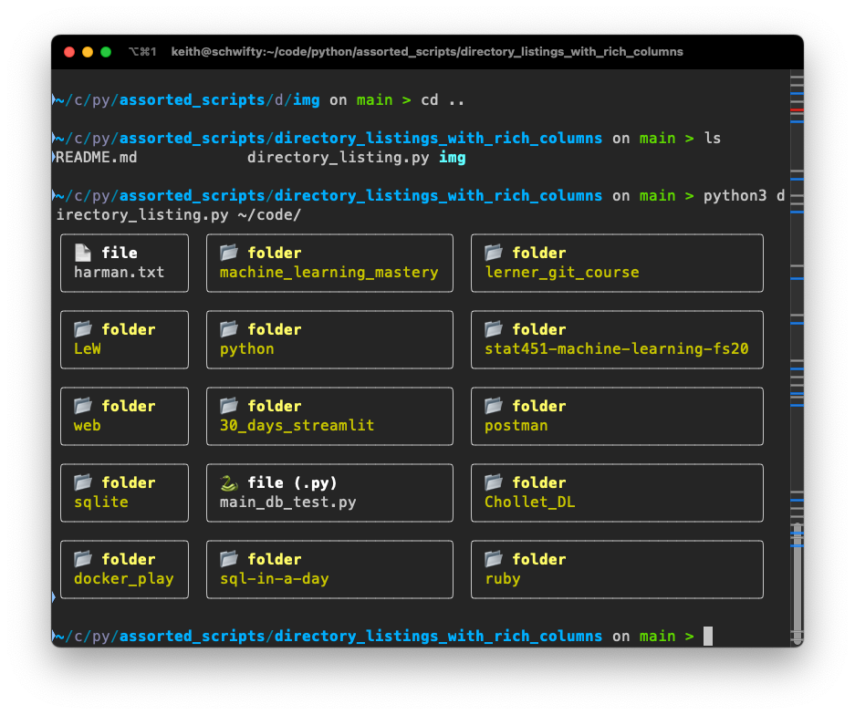

# directory_listings_with_rich_columns

 

 

#### Installation

Clone from: https://github.com/keith-taylor/assorted_scripts

NB: This is part of a collection of scripts saved in one repo. 

It uses [rich](https://github.com/Textualize/rich) to generate a columnar view of the contents of a folder (given as an argument on execution).

Note that python files have their own icons (🐍).

The project contains the following files:

- this README.txt
- directory_listing.py

#### Contact

 `@_thinkmachines_`

 https://github.com/keith-taylor 
